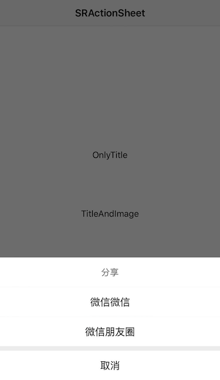
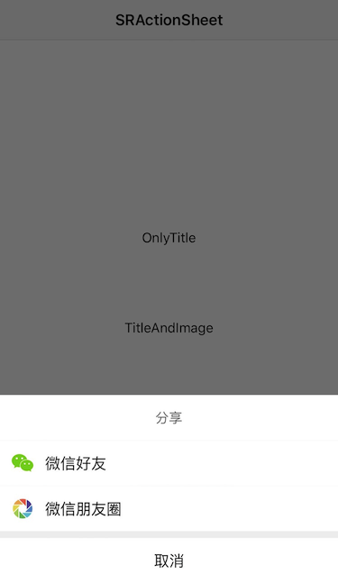

# SRActionSheet
**A brief style ActionSheet which is very similar to WeChat's ActionSheet.**




### Usage

````objc
// BLOCK
// Only Title
[SRActionSheet sr_showActionSheetViewWithTitle:@"分享"
                                   cancelTitle:@"取消"
                              destructiveTitle:nil
                                   otherTitles:@[@"微信微信", @"微信朋友圈"]
                                   otherImages:nil
                              selectSheetBlock:^(SRActionSheet *actionSheetView, NSInteger index) {
                                  NSLog(@"%zd", index);
                              }];          

// Title And Image
[SRActionSheet sr_showActionSheetViewWithTitle:@"分享"
                                   cancelTitle:@"取消"
                              destructiveTitle:nil
                                   otherTitles:@[@"微信好友", @"微信朋友圈"]
                                   otherImages:@[[UIImage imageNamed:@"share_wx_friend"], [UIImage imageNamed:@"share_wx_pengyouquan"]]
                              selectSheetBlock:^(SRActionSheet *actionSheetView, NSInteger index) {
                                  NSLog(@"%zd", index);
                              }];                          
````

````objc
// DELEGATE
// Only Title
[SRActionSheet sr_showActionSheetViewWithTitle:@"分享"
                                   cancelTitle:@"取消"
                              destructiveTitle:nil
                                   otherTitles:@[@"微信好友", @"微信朋友圈"]
                                      delegate:self];
                                      
// Title And Image                         
[SRActionSheet sr_showActionSheetViewWithTitle:@"分享"
                                   cancelTitle:@"取消"
                              destructiveTitle:nil
                                   otherTitles:@[@"微信好友", @"微信朋友圈"]
                                   otherImages:@[[UIImage imageNamed:@"share_wx_friend"], [UIImage imageNamed:@"share_wx_pengyouquan"]]
                                      delegate:self];
````

**If you have any question, please issue or contact me.**

**If you like it, please star me, thanks a lot.**

**Have Fun.**

