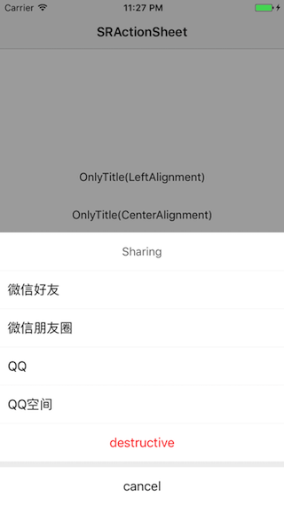
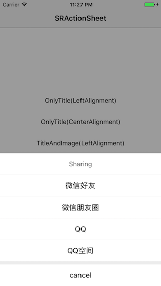
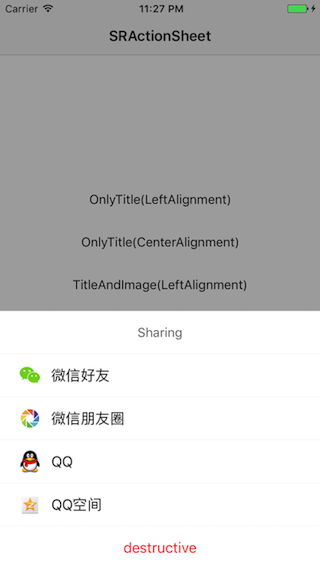
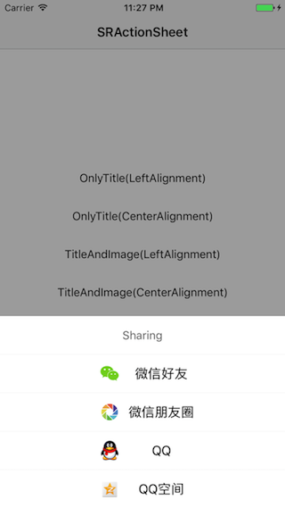

# SRActionSheet

## Features

* There are title, cancel citle, destructive title, other titles, other images for action sheet.
* Every one of them except other titles is optional.

## Screenshots

   

***

 

## Installation

### CocoaPods
> Add **pod ‘SRActionSheet’** to the Podfile, then run **pod install** in the terminal.

### Manual
> Drag the **SRActionSheet** folder to the project.


## APIs

````objc
/**
 Creates and returns an action sheet with title, cancelTitle, destructiveTitle, otherTitles, otherImages and selectSheetBlock.
 
 @param title            The title In the top.
 @param cancelTitle      The title of action item at the bottom.
 @param destructiveTitle The title of action item at the other action items bottom.
 @param otherTitles      The title of other action items.
 @param otherImages      The image of other action items.
 @param selectSheetBlock The callback block when select a action item.
 @return A SRActionSheet object.
 */
+ (instancetype)sr_actionSheetViewWithTitle:(NSString *)title cancelTitle:(NSString *)cancelTitle destructiveTitle:(NSString *)destructiveTitle otherTitles:(NSArray *)otherTitles otherImages:(NSArray *)otherImages selectSheetBlock:(SRActionSheetDidSelectSheetBlock)selectSheetBlock;

/**
 Creates and returns an action sheet with delegate.
 */
+ (instancetype)sr_actionSheetViewWithTitle:(NSString *)title cancelTitle:(NSString *)cancelTitle destructiveTitle:(NSString *)destructiveTitle otherTitles:(NSArray *)otherTitles otherImages:(NSArray *)otherImages delegate:(id<SRActionSheetDelegate>)delegate;

/**
 Displays the receiver.
 */
- (void)show;
````

## Usage

````objc
// Only title for other items 

// Left Alignment
SRActionSheet *actionSheet = [SRActionSheet sr_actionSheetViewWithTitle:@"Sharing"
                                                            cancelTitle:@"cancel"
                                                       destructiveTitle:@"destructive"
                                                            otherTitles:@[@"微信好友", @"微信朋友圈", @"QQ", @"QQ空间"]
                                                            otherImages:nil
                                                               delegate:self];
actionSheet.otherActionItemAlignment = SROtherActionItemAlignmentLeft;
[actionSheet show];       

// Center Alignment which is default
SRActionSheet *actionSheet = [SRActionSheet sr_actionSheetViewWithTitle:@"Sharing"
                                                            cancelTitle:@"cancel"
                                                       destructiveTitle:nil
                                                            otherTitles:@[@"微信好友", @"微信朋友圈", @"QQ", @"QQ空间"]
                                                            otherImages:nil
                                                       selectSheetBlock:^(SRActionSheet *actionSheet, NSInteger index) {
                                                           NSLog(@"%zd", index);
                                                       }];
[actionSheet show];                        
````

````objc
// Images and title for other items  

// Left Alignment which is default
SRActionSheet *actionSheet = [SRActionSheet sr_actionSheetViewWithTitle:@"Sharing"
                                                            cancelTitle:nil
                                                       destructiveTitle:@"destructive"
                                                            otherTitles:@[@"微信好友", @"微信朋友圈", @"QQ", @"QQ空间"]
                                                            otherImages:@[[UIImage imageNamed:@"share_wx_friend"],
                                                                          [UIImage imageNamed:@"share_wx_pengyouquan"],
                                                                          [UIImage imageNamed:@"share_qq_friend"],
                                                                          [UIImage imageNamed:@"share_qq_kongjian"]]
                                                       selectSheetBlock:^(SRActionSheet *actionSheet, NSInteger index) {
                                                           NSLog(@"%zd", index);
                                                       }];
[actionSheet show];

// Center Alignment
SRActionSheet *actionSheet = [SRActionSheet sr_actionSheetViewWithTitle:@"Sharing"
                                                            cancelTitle:nil
                                                       destructiveTitle:nil
                                                            otherTitles:@[@"微信好友", @"微信朋友圈", @"QQ", @"QQ空间"]
                                                            otherImages:@[[UIImage imageNamed:@"share_wx_friend"],
                                                                          [UIImage imageNamed:@"share_wx_pengyouquan"],
                                                                          [UIImage imageNamed:@"share_qq_friend"],
                                                                          [UIImage imageNamed:@"share_qq_kongjian"]]
                                                               delegate:self];
actionSheet.otherActionItemAlignment = SROtherActionItemAlignmentCenter;
[actionSheet show];
````

## Custom Settings

````objc
/**
 The alignment of other action items. 
 If no images default is SROtherActionItemAlignmentCenter otherwise default is SROtherActionItemAlignmentLeft.
 */
@property (nonatomic, assign) SROtherActionItemAlignment otherActionItemAlignment;
````