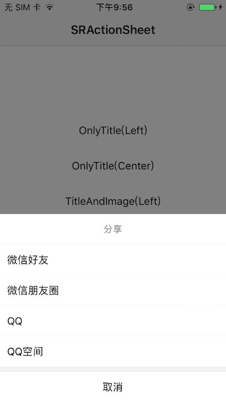
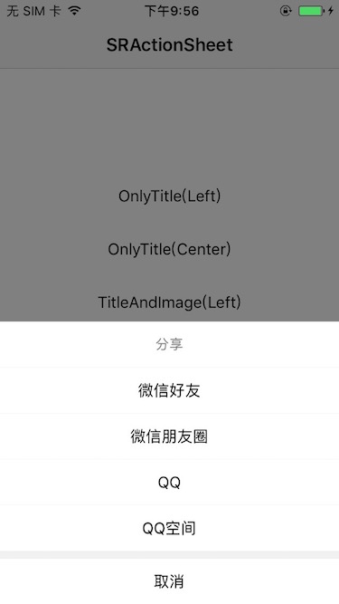
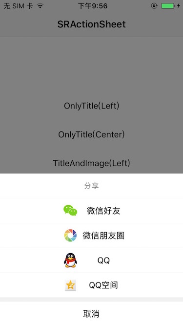

# SRActionSheet

## Features

* Provide two styles for other action items: only title, default alignment is left; title and image, default alignment is center.    
* Support custom alignment through otherActionItemAlignment property.

## Show

   

***

 

### CocoaPods
> Add **pod ‘SRActionSheet’** to the Podfile, then run **pod install** in the terminal.

### Manual
> Drag the **SRActionSheet** folder to the project.

## Usage

````objc
// Only Title 

// SROtherActionItemAlignmentLeft
SRActionSheet *actionSheet = [SRActionSheet sr_actionSheetViewWithTitle:@"Sharing"
                                                            cancelTitle:@"cancel"
                                                       destructiveTitle:@"destructive"
                                                            otherTitles:@[@"微信好友", @"微信朋友圈", @"QQ", @"QQ空间"]
                                                            otherImages:nil
                                                               delegate:self];
actionSheet.otherActionItemAlignment = SROtherActionItemAlignmentLeft;
[actionSheet show];       

// SROtherActionItemAlignmentCenter which is default
SRActionSheet *actionSheet = [SRActionSheet sr_actionSheetViewWithTitle:@"Sharing"
                                                            cancelTitle:@"cancel"
                                                       destructiveTitle:nil
                                                            otherTitles:@[@"微信好友", @"微信朋友圈", @"QQ", @"QQ空间"]
                                                            otherImages:nil
                                                       selectSheetBlock:^(SRActionSheet *actionSheetView, NSInteger index) {
                                                           NSLog(@"%zd", index);
                                                       }];
[actionSheet show];                        
````

````objc
// Title And Image  

// SROtherActionItemAlignmentLeft which is default
SRActionSheet *actionSheet = [SRActionSheet sr_actionSheetViewWithTitle:@"Sharing"
                                                            cancelTitle:nil
                                                       destructiveTitle:@"destructive"
                                                            otherTitles:@[@"微信好友", @"微信朋友圈", @"QQ", @"QQ空间"]
                                                            otherImages:@[[UIImage imageNamed:@"share_wx_friend"],
                                                                          [UIImage imageNamed:@"share_wx_pengyouquan"],
                                                                          [UIImage imageNamed:@"share_qq_friend"],
                                                                          [UIImage imageNamed:@"share_qq_kongjian"]]
                                                       selectSheetBlock:^(SRActionSheet *actionSheetView, NSInteger index) {
                                                           NSLog(@"%zd", index);
                                                       }];
[actionSheet show];

// SROtherActionItemAlignmentCenter
SRActionSheet *actionSheet = [SRActionSheet sr_actionSheetViewWithTitle:@"Sharing"
                                                            cancelTitle:nil
                                                       destructiveTitle:nil
                                                            otherTitles:@[@"微信好友", @"微信朋友圈", @"QQ", @"QQ空间"]
                                                            otherImages:@[[UIImage imageNamed:@"share_wx_friend"],
                                                                          [UIImage imageNamed:@"share_wx_pengyouquan"],
                                                                          [UIImage imageNamed:@"share_qq_friend"],
                                                                          [UIImage imageNamed:@"share_qq_kongjian"]]
                                                               delegate:self];
actionSheet.otherActionItemAlignment = SROtherActionItemAlignmentCenter;
[actionSheet show];
````

## Custom Settings

````objc
/**
 If no images default is SROtherActionItemAlignmentCenter otherwise default is SROtherActionItemAlignmentLeft.
 */
@property (nonatomic, assign) SROtherActionItemAlignment otherActionItemAlignment;
````

**Have Fun.**