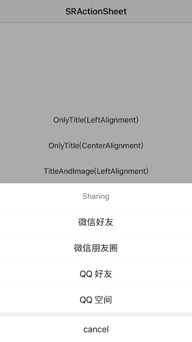

# SRActionSheet

A custom style ActionSheet, provide two styles for other action items.

## Screenshots




## Usage

````objc
/**
 Creates and returns an action sheet with title, cancelTitle, destructiveTitle, otherTitles, otherImages and selectSheetBlock.
 
 @param title            The title In the top.
 @param cancelTitle      The title of action item at the bottom.
 @param destructiveTitle The title of action item at the other action items bottom.
 @param otherTitles      The title of other action items.
 @param otherImages      The image of other action items.
 @param selectSheetBlock The callback block when select a action item.
 @return A SRActionSheet object.
 */
+ (instancetype)sr_actionSheetViewWithTitle:(NSString *)title cancelTitle:(NSString *)cancelTitle destructiveTitle:(NSString *)destructiveTitle otherTitles:(NSArray *)otherTitles otherImages:(NSArray *)otherImages selectSheetBlock:(SRActionSheetDidSelectSheetBlock)selectSheetBlock;
````

````objc
// Only title for other items
SRActionSheet *actionSheet = [SRActionSheet sr_actionSheetViewWithTitle:@"Sharing"
                                                            cancelTitle:@"cancel"
                                                       destructiveTitle:nil
                                                            otherTitles:@[@"微信好友", @"微信朋友圈", @"QQ 好友", @"QQ 空间"]
                                                            otherImages:nil
                                                       selectSheetBlock:^(SRActionSheet *actionSheet, NSInteger index) {
                                                           NSLog(@"%zd", index);
                                                       }];
[actionSheet show];                     
````

````objc
// Image and title for other items
SRActionSheet *actionSheet = [SRActionSheet sr_actionSheetViewWithTitle:@"Sharing"
                                                            cancelTitle:@"cancel"
                                                       destructiveTitle:nil
                                                            otherTitles:@[@"微信好友", @"微信朋友圈", @"QQ 好友", @"QQ 空间"]
                                                            otherImages:@[[UIImage imageNamed:@"share_wx_friend"],
                                                                          [UIImage imageNamed:@"share_wx_pengyouquan"],
                                                                          [UIImage imageNamed:@"share_qq_friend"],
                                                                          [UIImage imageNamed:@"share_qq_kongjian"]]
                                                       selectSheetBlock:^(SRActionSheet *actionSheet, NSInteger index) {
                                                           NSLog(@"%zd", index);
                                                       }];
[actionSheet show];
````

More contents please see SRActionsheetDemo.